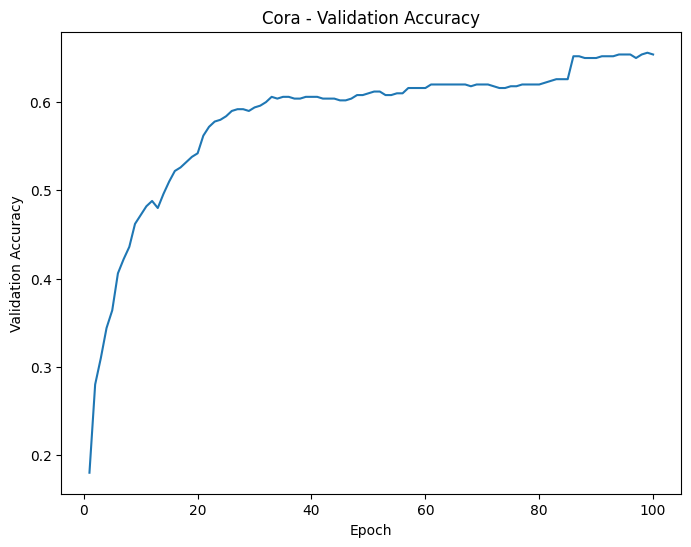
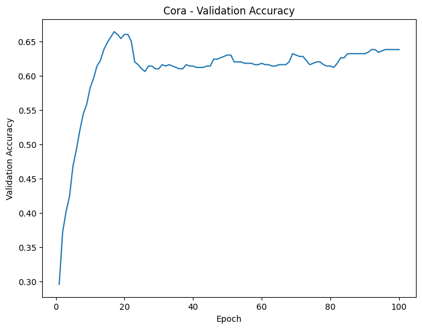
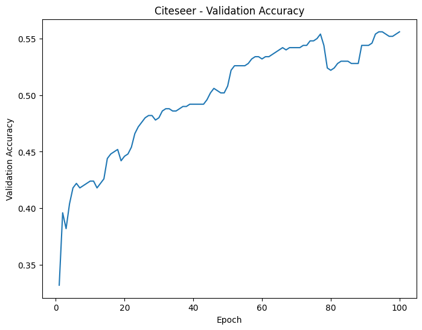
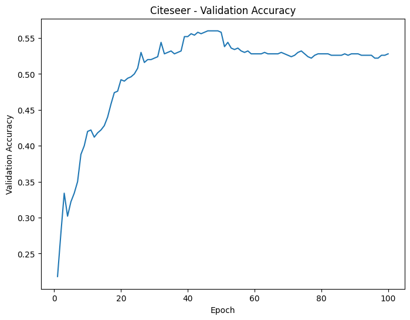
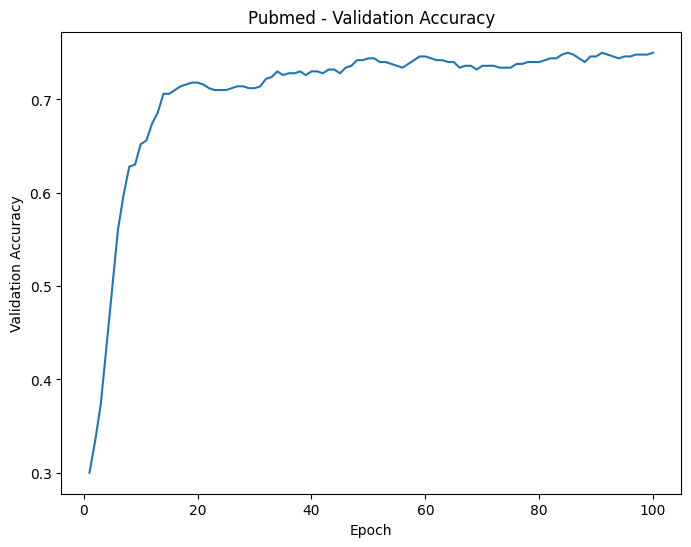
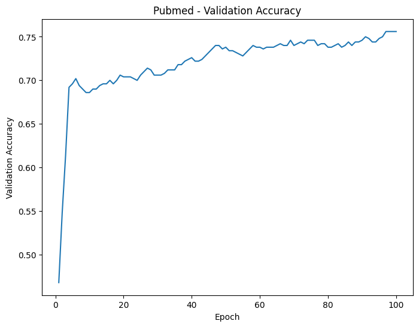

# Graph Attention Network Reproducibility

## Introduction
The objective of this study is to reproduce the results presented in the original Graph Attention Network (GAT) paper. The focus is on evaluating the impact of different activation functions on the performance of the GAT model and verifying the reproducibility of the results across various datasets. The following research questions are addressed:

1. How does changing the activation function used in calculating the attention score affect the node classification accuracy of the GAT model?
2. Is there a difference in the convergence speed of the model depending on the activation function used?

In this study, we replaced the Leaky ReLU activation function, typically used to calculate attention scores between neighbouring nodes, with the more nonlinear ELU (Exponential Linear Unit) function. The ELU function has the potential to capture more complex patterns and thus, could effectively learn the intricate relationships between nodes.

## GAT Implementation
The code for the GAT model is based on the pyGAT implementation.

## Experimental Setup
### Environment
- Google Colab TPU v2, 334.6 GB RAM
### Hyperparameters
To reproduce the performance of the original paper, all hyper-parameters were set with reference to the original paper (GAT).
- hidden node dimension: 8
- number of head: 8
- epochs: 100
- learning rate: 0.005
- dropout: 0.6
- alpah(leakyReLU): 0.2
- $\lambda_{PubmedDataset}$ = 0.001
- $\lambda_{elseDataset}$ = 0.005  

As with the original paper, the weight decay was set to 0.001 for the Pubmed dataset and 0.0005 for the other datasets.

### Datasets

The following datasets were used from the DGL library:

- Cora: A citation network with 2708 nodes and 5429 edges.
- Citeseer: A citation network with 3327 nodes and 4732 edges.
- Pubmed: A citation network with 19717 nodes and 44338 edges.

The original datasets are directed graphs, but following the methodology in the original paper, we converted them to undirected graphs for our experiments.

### Experimental Method
- Data Preprocessing: Load and preprocess each dataset.
- Model Training: Train the GAT model, evaluating the validation performance at each epoch.
- Evaluation Method: Train for 100 epochs, recording validation accuracy for each trial. The final model uses the state with the lowest validation loss. All experiments were repeated for 10 trials to compute average performance.

## Results

### Training Time
 The experiments were conducted using a Colab TPU v2 with 334.6 GB RAM. The training times for each dataset and activation function are as follows:

Using Leaky ReLU:
- Cora dataset: 29.30 seconds
- Citeseer dataset: 69.83 seconds
- Pubmed dataset: 4749.72 seconds

Using ELU:
- Cora dataset: 29.39 seconds
- Citeseer dataset: 72.80 seconds
- Pubmed dataset: 4800.00 seconds

### Validation Accuracy Plots
Here are the validation accuracy plots for each dataset and activation function:

#### Cora Dataset
- Leaky ReLU  

- ELU  

#### Citeseer Dataset
- Leaky ReLU   

- ELU  

#### Pubmed Dataset
- Leaky ReLU  

- ELU  

## Disscussion
The impact of changing the activation function on performance was found to be negligible, indicating that the choice of activation function may not be a critical factor in achieving high accuracy for GAT models. ELU was found to require longer training time on average than Leaky ReLU due to the stronger nonlinearity of ELU, which increases the computational demand; however, the performance improvement was not as proportional as expected.

In addition, the validation accuracy plots show that using the Leaky ReLU function resulted in more stable training with less fluctuation in accuracy than when using the ELU function. This suggests that Leaky ReLU, with its relatively weaker nonlinearity than ELU, may have provided more consistent training dynamics, contributing to the stability of the training process.

## Conclusion
In this study, we evaluated the reproducibility of GAT models and examined the impact of activation functions on attention scores between neighboring nodes. Our findings revealed a lower level of accuracy compared to the original paper, with the average best validation accuracy for the Cora dataset at 0.66 (Leaky ReLU) and 0.64 (ELU), for the Citeseer dataset at 0.56 for both functions, and for the Pubmed dataset at 0.75 for both functions.

Additionally, ELU required significantly longer training times: 29.39 seconds for Cora, 72.80 seconds for Citeseer, and 4816.39 seconds for Pubmed, compared to 29.30 seconds, 69.83 seconds, and 4749.72 seconds respectively with Leaky ReLU.

These results highlight the challenges of replicating GAT performance and suggest that experimental conditions are crucial. While activation functions affect training stability and duration, they are not the key factor in achieving high accuracy for GAT models.

## Reference
- Velickovic, P., Cucurull, G., Casanova, A., Romero, A., Lio, P., & Bengio, Y. (2017). Graph attention networks.